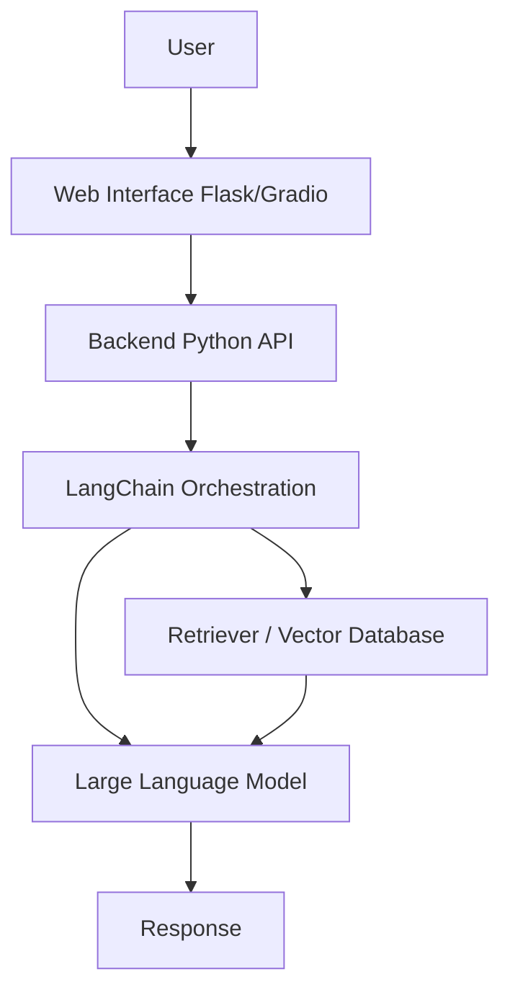

# System Architecture

```mermaid
flowchart TD

A[User]

B[Web Interface Flask/Gradio]

C[Backend Python API]

D[LangChain Orchestration]

E[Retriever / Vector Database]

F[Large Language Model]

G[Response]


A --> B
B --> C
C --> D
D --> E
D --> F
E --> F
F --> G

```

